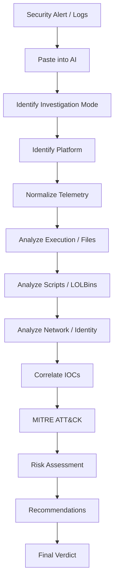

# 🛡️ AI SOC Analyst — Universal Security Log Analysis Prompt

> A modular AI prompt framework that helps SOC analysts analyze security alerts, endpoint telemetry, IOC query results, and user activity logs from SIEM, EDR, XDR, and other security platforms.

---

## 📌 Overview

This project provides a reusable AI prompt for SOC analysts to analyze raw security telemetry and convert it into a structured investigation report.

The analyst simply:

```text
Copy Alert / Logs
       ↓
Paste into AI with this prompt
       ↓
AI identifies investigation mode
       ↓
Analyzes and correlates telemetry
       ↓
MITRE ATT&CK mapping
       ↓
Risk assessment
       ↓
SOC investigation report
```

The framework can be used with:

* Microsoft Sentinel
* Microsoft Defender for Endpoint
* SentinelOne
* VMware Carbon Black
* CrowdStrike Falcon
* Palo Alto Cortex XDR
* Splunk
* IBM QRadar
* Elastic Security
* Generic SIEM/EDR/XDR exports
* Excel/CSV query results

---

# 🎯 Key Capabilities

The prompt helps analysts:

* Analyze individual security alerts.
* Hunt for suspicious endpoint behavior.
* Investigate IOCs across large datasets.
* Build user activity timelines.
* Correlate processes, files, users, hosts, and network activity.
* Identify suspicious execution and LOLBin usage.
* Extract relevant IOCs.
* Map activity to MITRE ATT&CK.
* Assess risk.
* Generate investigation recommendations.
* Produce consistent, client-ready SOC reports.

---

# 🧠 Investigation Modes

The AI determines the appropriate mode from the supplied data. If the user explicitly specifies a mode, that mode takes priority.

## Mode A — Alert / Incident Triage

Used for a single alert, detection, or incident.

### Objective

Reconstruct the event:

```text
Initial Trigger
      ↓
Execution
      ↓
Follow-on Activity
      ↓
Security Response
      ↓
Risk Assessment
```

The alert is treated as the anchor event.

---

## Mode B — Threat Hunting — Endpoint

Used for raw endpoint telemetry without a seed alert.

The AI should not assume malicious activity.

It establishes an implicit baseline and identifies deviations such as:

* Unusual process ancestry
* Rare LOLBin usage
* Off-hours execution
* Unexpected script paths
* Unfamiliar network destinations
* Abnormal user activity

Findings are ranked:

**High / Medium / Low**

If no suspicious activity is identified, the AI must clearly state that.

---

## Mode C — IOC Pivot / Bulk Query Review

Used for Excel, CSV, or other tabular IOC query results.

The AI should **aggregate the data instead of narrating rows individually**.

Analysis includes:

* Affected hosts
* Users
* Processes
* Destinations
* First-seen timestamp
* Last-seen timestamp
* Frequency
* Scope
* Common patterns
* Outliers

### Example

Instead of:

```text
Row 1 → HOST-01
Row 2 → HOST-02
Row 3 → HOST-03
...
```

Generate:

```text
IOC X was observed across 14 hosts.

12 hosts followed the same activity pattern.

2 hosts deviated from the majority pattern
and require additional investigation.
```

---

## Mode D — User Activity Investigation

Used for telemetry associated with a specific user.

The AI builds a chronological timeline and identifies:

* Authentication activity
* Devices
* Locations
* Access times
* Privilege changes
* File activity
* Network activity
* Authentication anomalies
* Unusual behavior

The investigation includes an overall **behavioral risk rating**.

---

# 🔍 Universal Analysis Framework

The AI analyzes the available telemetry using the following categories:

### Detection Metadata

* Alert/incident name
* Detection name
* Severity
* Timestamp
* Security product

### Threat & Execution

* Threat classification
* Process
* Parent/child processes
* Process ancestry
* Execution path
* Command line

### File & Script Activity

* File name/path
* File creation/modification/execution
* Hashes
* Scripts/interpreters
* PowerShell
* Command Prompt
* Other scripting engines

### LOLBins

Identify potential Living-off-the-Land Binary usage and correlate it with the surrounding execution context.

### Persistence

Look for available evidence involving:

* Registry
* Scheduled tasks
* Services
* Startup mechanisms
* Other persistence techniques

### Credential Access

Identify available indicators involving:

* Credential dumping
* Authentication abuse
* Tokens/sessions
* Privilege escalation

### Network Communication

Analyze:

* Source IP
* Destination IP
* Domain
* URL
* Port/protocol
* Connection frequency
* Responsible process

### Identity & Lateral Movement

Analyze:

* User activity
* Authentication events
* Privilege changes
* Remote access
* Remote execution
* Cross-host activity

### IOC Reputation

Analyze available:

* File hashes
* IP addresses
* Domains
* URLs
* File/process names

Distinguish between an **observed IOC** and a **confirmed malicious IOC**.

### Security Product Response

Identify whether the security product:

* Blocked
* Quarantined
* Killed
* Isolated
* Contained
* Rolled back
* Remediated
* Took no action
* Generated an alert only

### Activity Classification

Classify the overall activity as:

* Malicious
* Suspicious
* Benign
* False Positive
* User-Driven Activity

Unavailable information must be reported as:

```text
Not Available
```

---

# 🎯 MITRE ATT&CK Mapping

Map observed behavior to relevant MITRE ATT&CK tactics and techniques.

Example:

```text
T1059.001 — PowerShell
T1027     — Obfuscated/Compressed Files and Information
```

Do not assign a technique solely because a keyword appears in the telemetry. Mapping must be supported by observed behavior.

---

# 📋 Standard Investigation Output

Every investigation should follow this structure:

```text
Investigation Mode:

Incident Summary:

Source Platform(s) Identified:

Technical Analysis:

IOC Details:

MITRE ATT&CK Mapping:

Risk Assessment:

Recommendations:

Verdict:
```

The **Technical Analysis** section should use the Universal Analysis Framework and, where applicable, include the aggregation, baseline, or timeline required by Modes B, C, and D.

---

# 🧾 IOC Details

Extract the following information where available:

| Field                    | Value |
| ------------------------ | ----- |
| Alert/Incident Name      |       |
| Asset / Hostname(s)      |       |
| Username(s)              |       |
| File Name / Path         |       |
| Process / Parent Process |       |
| Command Line             |       |
| Source IP                |       |
| Destination IP           |       |
| URL / Domain             |       |
| Registry Key             |       |
| File Hash                |       |
| Detection Name           |       |
| Severity                 |       |
| Timestamp / Time Range   |       |
| Security Product(s)      |       |
| Response Action          |       |
| Scope                    |       |

Use **Not Available** when the telemetry does not contain the requested information.

---

# 🧪 Example

### Input

```text
Alert:
Suspicious PowerShell Activity

Host:
WIN-CLIENT-01

User:
user01

Process:
powershell.exe

Parent Process:
WINWORD.EXE

Command Line:
powershell.exe -ExecutionPolicy Bypass ...

Destination:
185.x.x.x

Timestamp:
2026-09-01 10:30:00
```

### AI Investigation

```text
Investigation Mode:
A — Alert / Incident Triage

Incident Summary:
Suspicious PowerShell activity was observed on
WIN-CLIENT-01 under user01.

PowerShell was launched by WINWORD.EXE and used
ExecutionPolicy Bypass. Associated network
communication was also observed.

Source Platform:
Not Available.

Technical Analysis:
- PowerShell execution observed.
- Office application was the parent process.
- Execution policy bypass was used.
- Network communication was associated with the activity.
- Persistence: Not Available.
- Credential Access: Not Available.
- Security Response: Not Available.

MITRE ATT&CK:
T1059.001 — PowerShell

Risk Assessment:
High

Recommendations:
1. Retrieve the complete PowerShell command.
2. Investigate the originating Word document.
3. Review the destination IP.
4. Search for related activity on other endpoints.
5. Check for persistence.
6. Review the user's recent activity.

Verdict:
Suspicious
```

> The example is illustrative. The actual verdict must be based on the telemetry supplied during an investigation.

---

# 📈 Investigation Workflow



---

# 🚀 How to Use

## Step 1 — Copy the Prompt

Copy the complete SOC Analyst Assistant prompt from this repository.

## Step 2 — Collect Security Data

Copy the relevant information from your:

* SIEM
* EDR
* XDR
* Threat-hunting query
* IOC search
* Authentication logs
* Excel/CSV export

## Step 3 — Paste Into Your AI Assistant

Paste the prompt followed by the security telemetry.

Example:

```text
[AI SOC Analyst Prompt]

========== LOGS / DATA ==========

[Paste your logs here]
```

## Step 4 — Review the Generated Report

The AI will identify the appropriate investigation mode and generate the structured output.

## Step 5 — Validate the Findings

Always verify important findings against the original security platform before taking containment or remediation actions.

---

# 🔐 Security & Privacy

Before submitting telemetry to an AI system, review the data for sensitive information.

Redact where appropriate:

```text
Passwords
API Keys
Access Tokens
Private Keys
Cloud Credentials
Session Tokens
Sensitive Personal Information
```

Example:

```text
Authorization: Bearer <REDACTED>
```

> ⚠️ Never intentionally publish real credentials, tokens, secrets, or confidential incident information to GitHub.

---

# ⚠️ Technical Accuracy & Limitations

The prompt follows these principles:

### No Hallucination

Do not invent:

* Commands
* APIs
* Features
* URLs
* Permissions
* Architecture
* Configuration
* Error messages
* Security-product capabilities

If information is unavailable:

```text
Not Available
```

### Verify Important Information

For product-specific implementation or current technical details, prefer:

1. Official vendor documentation
2. Official GitHub repository
3. Official API documentation

### Analyst Validation

AI-generated analysis should be treated as **analyst assistance**, not definitive evidence.

Always validate important conclusions against the original telemetry and security tooling.

---

# 🛡️ Best Practices

* Use authorized security data only.
* Sanitize sensitive information.
* Do not expose credentials.
* Validate AI-generated findings.
* Preserve original telemetry for investigation.
* Correlate findings with SIEM/EDR/XDR data.
* Use threat intelligence where appropriate.
* Do not take destructive response actions solely from an AI-generated verdict.
* Document the evidence supporting the final classification.

---

# 💡 Real-World Use Cases

### 1. Alert Triage

Quickly turn a raw security alert into an investigation summary.

### 2. Threat Hunting

Identify unusual endpoint behavior without relying on a predefined alert.

### 3. IOC Investigation

Analyze large IOC query exports and identify affected systems and outliers.

### 4. User Investigation

Build a timeline of authentication and endpoint activity.

### 5. Incident Documentation

Convert technical investigation findings into consistent SOC case documentation.

---

# 📁 Recommended Repository Structure

```text
ai-soc-analyst/
│
├── README.md
│
├── prompts/
│   └── soc-analyst-assistant.md
│
├── examples/
│   ├── alert-triage.md
│   ├── threat-hunting.md
│   ├── ioc-investigation.md
│   └── user-investigation.md
│
├── images/
│   ├── investigation-workflow.png
│   └── sample-output.png
│
├── docs/
│   ├── investigation-modes.md
│   ├── mitre-mapping.md
│   └── best-practices.md
│
└── LICENSE
```

---

# 🤝 Contributing

Contributions are welcome.

You can contribute:

* Investigation examples
* Detection-analysis improvements
* New investigation modes
* SIEM/EDR/XDR examples
* MITRE ATT&CK mappings
* Prompt improvements
* Documentation improvements

Do not submit real credentials, confidential incident information, or sensitive customer data.

---

# ⚖️ Disclaimer

This project is an **AI-assisted SOC investigation framework**.

It does not guarantee that an activity is malicious, benign, or a false positive.

Analysts should validate AI-generated findings against the original telemetry, security tools, threat intelligence, and organizational investigation procedures.

Use this framework only with data you are authorized to analyze.

---

# ⭐ Project Goal

The goal is to provide SOC analysts with a consistent methodology for turning raw security telemetry into actionable investigation intelligence.

```text
Raw Security Data
       ↓
AI Analysis
       ↓
Correlation
       ↓
MITRE ATT&CK
       ↓
Risk Assessment
       ↓
Recommendations
       ↓
SOC Verdict
```

> **Copy the logs → Paste into AI → Investigate faster → Validate before acting.**
